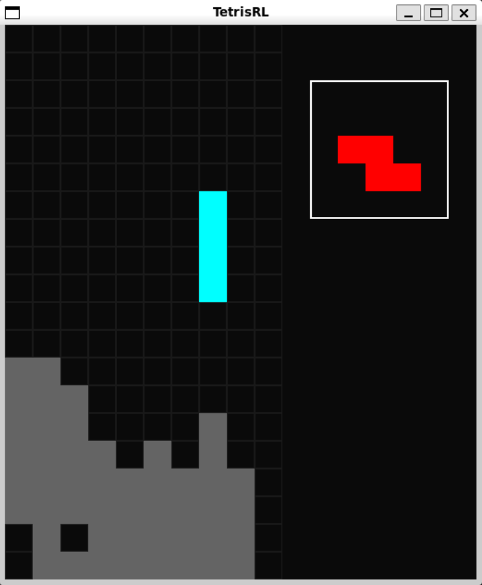

# Tetris AI Project



This project is a Python-based Tetris game with reinforcement learning (RL) agents. Originally developed as a final project for a course (in branch **cs394r_project**), I ([Richard Noh](https://github.com/RichardNooooh/)) am continuing development independently after the course ended. The project features three different agents (more later?), a graphical user interface (GUI) that is decoupled from the game logic, and a simplified environment with no auto-falling tetriminos.

## File Structure
```
- docs/
- tetris/
    - env.py:       game logic
    - state.py:     data structures for board and tetrimino
    - feature.py:   functions that extract features from the board and tetrimino
    - gui.py:       (optional) PyGame GUI that merely visualizes the game state
- trained_models/:  stores all trained agent models (ex: neural network weights)
- agent_base.py:    abstract class for agents
- agent_*.py:       implementation of agent + training...
- test_*.py:        runs the agent without training
```

## RL Problem Statement
For a detailed description, see our [report](docs/TetrisProject.pdf).

### State Space: $\mathcal{S}$
We define the state space, $\mathcal{S}$, where $s$ is an element of $\mathcal{S}$, to be the collection of the board configuration (filled and empty tiles) with the current "falling" tetrimino's position, orientation, and type.

Note that the code represents $s$ in the same way as classic NES Tetris, as described by MeatFighter's excellent [article](https://meatfighter.com/nintendotetrisai/).

### Action Space: $\mathcal{A}$
We define the action space to be the classic 5 NES button actions:
- move left
- move right
- rotate clockwise
- rotate counter-clockwise
- soft drop

The agent has full control over the tetrimino. Since there is no "time dependence" or automatic dropping, the agent could indefinitely spin/shift in place without falling. This action space is implemented as `env.step()`.

### Abstracted Action Space: $\mathcal{A}_g(s)$
The $\mathcal{A}$ action space has a high learning complexity, since it forces the agent to not only learn how to strategically place the tetriminos, but also how to move that tetrimino into those strategic positions.

A common approach is to group the actions, so that each "group action" (coined in [this paper](https://cs231n.stanford.edu/reports/2016/pdfs/121_Report.pdf)) results in a tetrimino in a so-called "landing position". This reduces the learning complexity, since the agent can simply learn where to place the tetrimino, instead of moving it around. I denote this action space as $\mathcal{A}_g(s)$, where $s \in \mathcal{S}$. Note that this action space is dependent on $s$, since each possible landing position is dependent on the current state of the board. This action space is implemented as `env.group_step()`.

### Abstracted State Space: $\mathcal{S}_g$
Since there are an absurd number of states in $\mathcal{S}$ (~$2^{200}$ states from board configurations, alone), we have to abstract this state for most RL agents. This is accomplished by considering a set of features, like the number of holes in the current grid. We use the set of features described in this [BCTS paper](https://inria.hal.science/inria-00418954/document). This is implemented in `feature.py`.

### Rewards: $\mathcal{R}$
For our abstracted action space, we have the following reward function:
- $+10\times\texttt{num\_lines\_cleared}$
- $-10000$ for ending the episode
- $+0.01$ for each group action

## Agents

### BCTS (Non-learning)
This is a linear function approximation agent, whose weights were determined with the cross-entropy method (see the [BCTS paper](https://inria.hal.science/inria-00418954/document)) on the features in $\mathcal{S}_g$. From my brief testing, this agent can clear tens of thousands of lines before ending a single episode. Note that this agent is not a true RL agent. It does not learn.

To run:
```
python agent_bcts.py
```

### SARSA($\lambda$)
This is also a linear function approximation agent, but the weights are learned with the SARSA($\lambda$) algorithm (see [Sutton and Barto](http://incompleteideas.net/sutton/book/RLbook2018.pdf)). As of May 21, 2024, I have not optimized the hyperparameters on this agent, so I have not seen this agent obtain a good policy, just yet.

To run:
```
python agent_sarsa.py
```

### Deep Q-Learning (DQN)
This is a much more interesting agent. Instead of observing features from $\mathcal{S}_g$, this agent uses convolutional layers that reads the state from $\mathcal{S}$ and corresponding action in $\mathcal{A}_g(s)$ to evaluate the Q value function. This agent uses an experience buffer with a delayed target update network to overcome the overfitting/instability problems associated with these deep neural network models. Additional details on this agent are in the [report](docs/TetrisProject.pdf), and a screenshot of the overall training algorithm is located [here](docs/imgs/dqn_algo.png).

The model weight file in `trained_models/` is obtained by training this deep learning agent on my RTX 2070 super for approximately 15 hours.

To train:
```
python agent_dqn.py
```

To run the trained model:
```
python run_dqn.py
```


### Other Agents...
My plan for this project is to implement other RL agents into Tetris.

## Dependencies
The only real dependencies are:
```
- numpy
- pytorch
```

`pygame` is optional, as it is only used for the visualization.

TODO make sure that all of the files can easily be modified to remove TetrisGUI...
